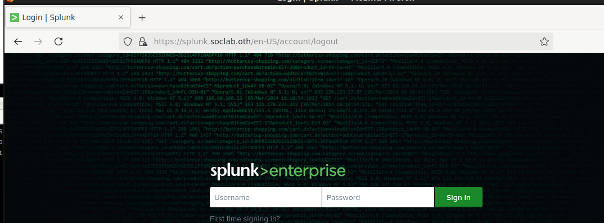
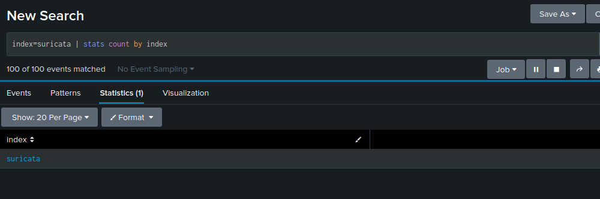
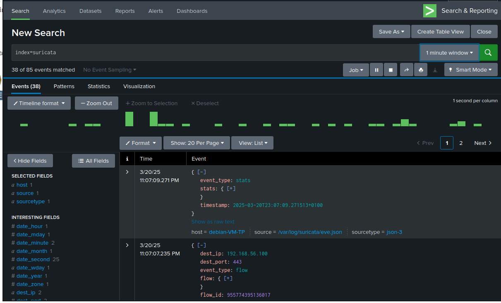

# Homelab Cybersecurity Monitoring and Incident Response

## Overview
This project aims to build a Security Operations Center (SOC) in a homelab environment using various open-source security tools. The goal is to monitor and analyze network traffic, detect threats, and simulate attacks for security testing.

## Infrastructure
**Virtualization:** VirtualBox

Each VM has two network interfaces:
- **Internal Network (Host-Only):** Used for isolated communication between VMs.
- **NAT Interface:** Used for internet access.

### **Network Configuration**
Each VM is assigned a static IP and DNS configuration:

#### **Security VM (Splunk + Suricata IDS/IPS)**
- Internal IP: `192.168.56.100`
- DNS Name: `splunk.soclab.oth`

#### **Network VM (BIND DNS + Syslog Server)**
- Internal IP: `192.168.56.101`
- DNS Name: `dns.soclab.oth`

#### **Kali Linux (Attack Simulation)**
- Internal IP: `192.168.56.102`

#### **Web Server (Apache with Virtual Host)**
- Internal IP: `192.168.56.103`
- DNS Name: `web.soclab.oth`

---
## **Configurations**

### **1️⃣ Static Network Configuration**
Edit `/etc/network/interfaces`:
```ini
# The loopback network interface
auto lo
iface lo inet loopback

# Primary network interface (NAT - DHCP)
auto eth0
iface eth0 inet dhcp

# Secondary network interface (Internal - Static)
auto eth1
iface eth1 inet static
    address 192.168.56.X
    netmask 255.255.255.0
    gateway 192.168.56.1
    dns-nameservers 192.168.56.101
```
Prevent **resolv.conf** from being overwritten:
```bash
sudo chattr +i /etc/resolv.conf
```

---
### **2️⃣ DNS Configuration (BIND9 on Network VM)**
```bash
sudo apt install bind9 -y
```
Edit `/etc/bind/named.conf.local`:
```ini
zone "soclab.oth" {
    type master;
    file "/etc/bind/db.soclab.oth";
};
```
Create the zone file `/etc/bind/db.soclab.oth`:
```ini
$TTL 86400
@   IN  SOA dns.soclab.oth. root.soclab.oth. (
        2024031501  ; Serial
        3600        ; Refresh
        1800        ; Retry
        604800      ; Expire
        86400 )     ; Minimum TTL

    IN  NS  dns.soclab.oth.
dns IN  A   192.168.56.101
splunk IN  A   192.168.56.100
web IN  A   192.168.56.103
```
Restart BIND:
```bash
sudo systemctl restart named
```

---
### **3️⃣ Install & Configure Splunk**
To install splunk, first create an account in splunk website and ask for a enterprise trial which will be valid for 60 days. Splunk will give you a custom url
```bash
wget -O splunk.deb custom_url
sudo dpkg -i splunk.deb
sudo /opt/splunk/bin/splunk start --accept-license
```
Don't forget to replace custom_url with your actual url given by splunk.

---
### **4️⃣ Apache Reverse Proxy for Splunk**
Install Apache:
```bash
sudo apt install apache2
sudo a2enmod proxy proxy_http proxy_https ssl headers
```
Configure Virtual Host `/etc/apache2/sites-available/splunk.conf`:
```ini
<VirtualHost *:80>
    ServerName splunk.soclab.oth
    Redirect permanent / https://splunk.soclab.oth/
</VirtualHost>

<VirtualHost *:443>
    ServerName splunk.soclab.oth
    SSLEngine on
    SSLCertificateFile /etc/ssl/certs/apache-selfsigned.crt
    SSLCertificateKeyFile /etc/ssl/private/apache-selfsigned.key

    ProxyPreserveHost On
    ProxyPass / http://localhost:8000/
    ProxyPassReverse / http://localhost:8000/
</VirtualHost>
```
Enable the site and restart Apache:
```bash
sudo a2ensite splunk.conf
sudo systemctl restart apache2
```
Access Splunk: [https://splunk.soclab.oth](https://splunk.soclab.oth) and connect with the admin credentials created during the installation of Splunk




---
### **5️⃣ Install & Configure Suricata**
```bash
sudo apt install suricata -y
```
Configure Suricata `/etc/suricata/suricata.yaml` (set `eth1` as the monitored interface ==> internal network for the lab):
```yaml
af-packet:
  interface: eth1
```
Enable IDS rules and restart Suricata:
```bash
sudo suricata-update
sudo systemctl restart suricata
```

### Configuring Splunk to Ingest Suricata Logs
1. Open the Splunk inputs configuration file:
   ```bash
   sudo nano /opt/splunk/etc/apps/search/local/inputs.conf
   ```
2. Add the following configuration to monitor Suricata logs:
   ```ini
   [monitor:///var/log/suricata/eve.json]
   sourcetype = suricata
   index = suricata
   followTail = 1
   disabled = false

   [monitor:///var/log/suricata/eve.json - alert - dns - http - tls - ssh - flow - anomaly]
   sourcetype = suricata
   index = suricata
   followTail = 1
   disabled = false
   ```
3. Restart Splunk to apply changes:
   ```bash
   sudo systemctl restart splunk
   ```

### Verifying Suricata Logs in Splunk
Run the following Splunk search query to check if logs are being ingested:

```splunk
index=suricata | stats count by source
```



Now we can seach for events in the suricata index using

```splunk
index="suricata"
```



## Next Steps
Now that Splunk is ingesting logs successfully, the next steps are:
- Creating dashboards in Splunk for better log analysis.
- Configuring Suricata rules for detecting attacks.
- Implementing alerting mechanisms in Splunk.

Stay tuned for further updates!


---
## **Next Steps**
✅ Configure log forwarding (Suricata logs → Splunk)
✅ Set up attack simulation using Kali Linux
✅ Visualize logs using Grafana
✅ Document findings & incident response process

